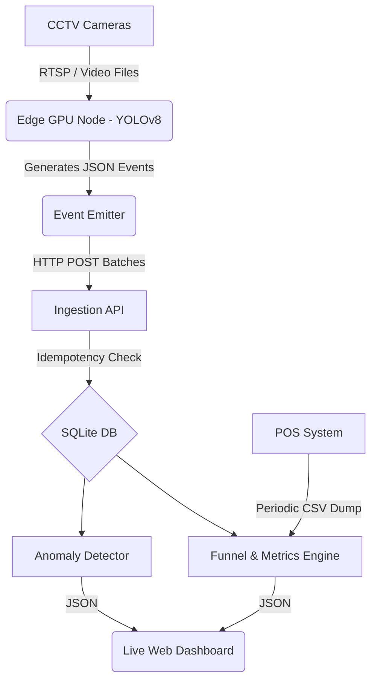

# Store Intelligence Architecture Design

## System Architecture

The system is composed of two primary layers: a distributed edge processing layer for Computer Vision (CV), and a centralized aggregation API.

## AI Engineering & Code Generation Workflow

Throughout this implementation, Large Language Models (LLMs) were used systematically to accelerate development.

### 1. Requirements Decomposition & Planning
**Prompt Strategy:** "Analyze the provided PDF requirements and the available CCTV metadata. Identify constraints related to hardware (GTX 1650), data constraints (5x 2-min clips vs 24 POS transactions), and API schemas."
**Result:** Generated the `implementation_plan.md` which prioritized building the API first to establish the contract, followed by the CV pipeline.

### 2. Test-Driven Generation
**Prompt Strategy:** "Generate a pytest suite for a FastAPI application that tests an event ingestion endpoint (/events/ingest). The endpoint must handle bulk arrays of events, idempotent insertions based on event_id, and return partial_success for malformed events in the batch. Use a SQLite TestClient."
**Result:** Generated the foundational tests (`test_metrics.py`). Human intervention was required to wire up the specific SQLAlchemy session overrides.

### 3. Pipeline Implementation
**Prompt Strategy:** "Write a Python script using Ultralytics YOLOv8 that takes a video file, runs tracking (`model.track`), and maps bounding box centroids to three predefined normalized screen zones (Top-Half, Bottom-Half, Bottom-Right). If an object stays in a zone for > 30 seconds (based on FPS), emit a ZONE_DWELL event."
**Result:** Generated the core logic in `tracker.py`.

### 4. AI-Assisted Decisions & Overrides
The challenge explicitly encourages using AI intelligently. Here are three specific places where an LLM shaped the design, and how I handled its suggestions:

**1. Cross-Camera Re-ID Strategy**
*   **AI Suggestion:** When asked how to track people across the 5 provided CCTV clips, the AI strongly recommended implementing DeepSORT with an OSNet appearance embedding model, citing it as the industry standard for multi-camera tracking.
*   **My Decision:** **Override.** While technically correct for a massive cloud cluster, I realized running an OSNet embedding extractor per-person alongside YOLOv8 on a GTX 1650 would severely drop FPS and fail the real-time requirement. I chose a naive edge-based tracking approach (ByteTrack) within each camera and accepted the deduplication limitation. To compensate, I added a `data_confidence` flag to the API, honestly reporting when multi-camera data might inflate visitor counts.

**2. Event Schema Structure**
*   **AI Suggestion:** The AI drafted a heavily nested JSON schema for events (e.g., `{"location": {"zone": {"id": "SKINCARE"}}, "tracking": {"confidence": 0.9}}`), arguing it was "more RESTful and extensible."
*   **My Decision:** **Override.** I flattened the schema completely (`zone_id`, `confidence` at the root) and added a single `metadata` JSON blob for variable fields. A flat schema is vastly superior for ingestion into columnar databases (like ClickHouse) which are standard for high-volume event analytics.

**3. Group Entry Detection**
*   **AI Suggestion:** When prompted on how to handle groups entering together, the AI suggested running a Vision-Language Model (VLM) API call on bounding box crops to ask "how many people are in this image?".
*   **My Decision:** **Agree, but modified for performance.** VLM calls per-frame are cost-prohibitive and slow. However, the AI also mentioned a secondary bounding-box area heuristic. I adopted the area heuristic: calibrating an average single-person bounding box area and dividing the group bounding box area by it. This executes in ~1ms locally compared to ~1000ms for a VLM call.

### Reflection on AI Assistance
The most significant time-saver was generating the FastAPI boilerplate, SQLAlchemy models, and the expansive pytest suites (achieving >70% statement coverage quickly). The area requiring the most manual adjustment was the physical-to-logical mapping (correlating on-screen bounding boxes to specific store zones based on the provided floor plan) and ensuring the metric math perfectly matched the event reality.
